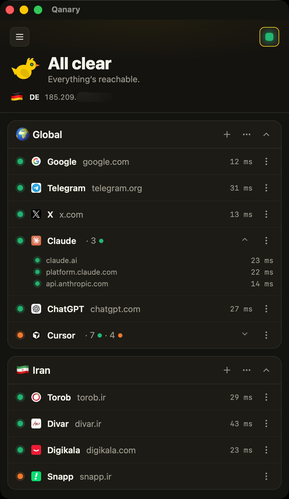

<div align="center">
  
</div>

---

Desktop connectivity monitor. Traffic-light status for whether your machine can reach a list of services — useful on restricted or censored networks where some services are blocked and others aren't.

<div align="center">
  
</div>

| Severity  | When                                     |
| --------- | ---------------------------------------- |
| 🟢 Green  | Everything reachable                     |
| 🟠 Orange | A non-critical list is fully unreachable |
| 🔴 Red    | A critical list is fully unreachable     |

Seeded defaults: **Global** list is critical (red alarm), **Iran** list is non-critical (orange warn). All lists are fully configurable — flip the **Critical** toggle on any of them.

- Shows WAN IP + country flag.
- Add your own services and lists. Config persisted as local JSON.
- Lives in the **system tray** with a dynamic icon that mirrors current status (green / orange / red).
- Native **desktop notifications** on critical-list status transitions — fire when a critical list goes fully down and again on recovery (with optional sound).
- **Launch at login** and **Hide the Dock icon** (macOS) for menu-bar-only operation — both in **Settings**.
- **Dark / light theme** following the system, with a manual override in the menu.

## Lists

Each list has a **Critical** toggle (in the add / edit modal). When on, that list going fully down raises a red alarm. When off, it only warns orange.

To edit a list: tap `⋯` next to the list name → **Edit**.

## Notifications

Qanary sends a native desktop notification when a **critical** list changes state — fully down (`up → down`) and again on recovery (`down → up`). Each can carry a sound. Only critical lists notify, so mark a list **Critical** to start receiving them. Toggle notifications and sound in **Settings**.

## Services

Add or edit services from the modal. Each non-blank line is one service.

- **Custom ports** — `host:port` to probe a specific port instead of 443. Example: `api.example.com:8080`.
- **Multi-endpoint** — comma-separate hosts on one line. Example: `Mail: smtp.example.com:465, imap.example.com:993`. The row rolls up reachable / blocked / down; expand to see each endpoint and latency.
- **Bulk input** — paste many lines at once. One service per line.
- **Label** — prefix with `Label:` to name it (`Search: google.com`). Without a label, the first host becomes the name.

Each service can be edited or removed from its row's `⋯` menu.

## Stack

- **Tauri v2** (Rust backend) + **React + Vite + TypeScript** frontend.
- Probe = TCP connect + HTTPS HEAD → classify Up / Blocked / Down.
- Config stored at:
  - **macOS:** `~/Library/Application Support/com.qanary.app/config.json`
  - **Linux:** `~/.config/com.qanary.app/config.json`
  - **Windows:** `C:\Users\<user>\AppData\Roaming\com.qanary.app\config.json`

## Develop

```bash
source "$HOME/.cargo/env"   # until login shell picks up cargo
pnpm install                 # frontend deps
pnpm run tauri dev           # run app (dev)
pnpm run tauri build         # release bundle
cd src-tauri && cargo test   # Rust unit tests
```

Requires Node, Rust (rustup), and Xcode CLT on mac.

## Releases

Prebuilt apps are on the [Releases page](https://github.com/Esi-Abolfazl/Qanary/releases).

> **First launch (macOS):** Gatekeeper may block the app. Either right-click → Open, or run:
>
> ```bash
> xattr -cr /Applications/Qanary.app
> ```

## In-app updates

Qanary checks for updates silently on every launch. Update button appears when a newer version is available — You can also trigger a check from **Settings**. After it relaunches, a what's-new dialog shows the new version's release notes.
